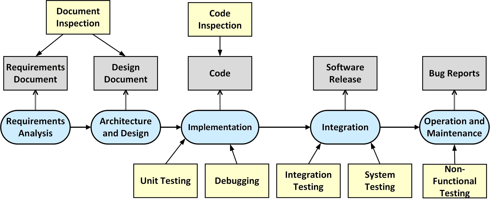

# Embedded Softwarequality and Security

This repository collects examples, exercises and model solutions needed to understand
the concepts of code inspection, software testing and software security in the 
software development lifycycle.

The following topics will be covered:

1. **Introduction**
    * [Programming Languages for Embedded Systems](introduction/ProgrammingLanguages.md)
    * [Python Programming](https://github.com/teiniker/teiniker-lectures-python)
    * [Debugging](debugging)

2. **Software Inspection**
    * [Introduction](inspection)

3. **Software Testing**

4. **Software Security**

As a development environment, you can use a pre-configured **Debian 12.7 Linux VM**
image:
[Virtual Lab](https://drive.google.com/drive/folders/1AzsF4Mvh1HJ8k6OW5W5hQ5CF0HdqA51l)

## References
* Andreas Zeller. **Why Programs Fail - A Guide to Systematic Debugging**. dpunkt.verlag, 2009
* Glenford J. Myers, Corey Sandler, Tom Badgett.**The Art of Software Testing**. Wiley, 3rd edition 2012
* Lisa Crispin, Janet Gregory. **Agile Testing**. Addison Wesley, 2009

*Egon Teiniker, 2020-2025, GPL v3.0*

