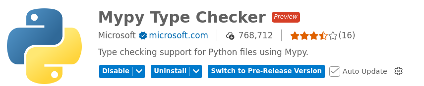

# Type Hints

Languages such as C/C++ or Java are statically typed. Essentially 
this means that type checking will take place at compile time based 
on the source code.

Python is known for its **duck typing** (dynamically typed) system 
which is very flexible but often lacks the safety which a static type 
analysis can offer and is, usually, desired for larger software projects.

**PEP 484** has introduced a way of performing static type checking 
of Python code by using type hints and a static type checker such 
as **mypy**.

The static type checking and the type hints can be introduced at 
**specific parts of the code** where such typing safety is desired.


## Type Hints in Functions 

Python type hints let us describe what kinds of parameter values a function 
expects and returns.

**Basic syntax**:

```Python
def fn(arg1:type1, arg2:type2, ...) -> ReturnType:
    pass
```

_Example:_ Parameter list and return value

```Python
def max_value(a:int, b:int) -> int:
    if a > b:
        return a
    else:
        return b
```

_Example:_ Default values

```Python
def power(base: int, exponent: int = 2) -> int:
    return base ** exponent
```

_Example:_ Lists, dictionaries, tuples

```Python
def total(prices: list[int]) -> int:
    return sum(prices)

def get_user() -> dict[str, str]:
    return {"name": "Homer", "city": "Springfield"}

def point() -> tuple[int, int]:
    return (10, 20)
```

_Example:_ Optional values (if a parameter can be None)

```Python
def print_name(name: str | None) -> None:
    if name is None:
        print("No name")
    else:
        print(name)
```

_Example:_ Many possible types

```Python
def stringify(value: int | float | str) -> str:
    return str(value)
```    

_Example:_ Any type (allow anything)

```Python
from typing import Any

def debug(value: Any) -> None:
    print(value)
```    
This is flexible, but less precise.


## Type Hints in Classes

Python type hints in classes are mainly used to describe the types of 
attributes and methods.

_Example:_ Type hints for instance attributes

```Python
class Article:
    oid: int
    description: str
    price: int

    def __init__(self, oid: int, description: str, price: int) -> None:
        self.oid = oid
        self.description = description
        self.price = price
```    

Because the attributes only use type hints (:) and assigns no actual values, 
they aren't realized class attributes in standard Python.

Here we use type hints for both:

* **Attribute annotations** document the expected instance attributes 
    of the class (readers can see what data the object has).

* **Constructor annotations** document what arguments callers must pass 
    to create the object.  


_Example:_ Type hints in methods

```Python
    def formatted_price(self) -> str:
        return f"{self.price} cents"

    def apply_discount(self, percent: float) -> float:
        return self.price * (1 - percent / 100)
```    

_Example:_ Type hints for class variables

Sometimes a variable belongs to the class itself, not each instance. 
Use `ClassVar`.

```Python
class Article:
    category: ClassVar[str] = "General"
```    

_Example:_ Dataclass

```Python
@dataclass
class Article:
    oid:int
    description:str
    price:int
```

_Example:_ Referring to other classes (a class use another class as an attribute type)

```Python
class Author:
    name: str

    def __init__(self, name: str) -> None:
        self.name = name


class Article:
    title: str
    author: Author

    def __init__(self, title: str, author: Author) -> None:
        self.title = title
        self.author = author
```    


## Using a Static Type Checker

**mypy** is a static type checker for Python.
Type checkers help ensure that you're using variables and functions 
in our code correctly. 
With `mypy`, add type hints (PEP 484) to your Python programs, 
and mypy will warn you when you use those types incorrectly.

### Setup

To install `mypy`, type:

```bash
$ pip install mypy
```

### Using mypy

In order to check existing code we use:
```bash
$ mypy python_module_name.py
```
Should any type inconsistencies be detected, then such errors will 
be reported! Otherwise, `mypy` will run silently!

The `--ignore-missing-imports` flag makes mypy ignore all missing 
imports that do not have type definitions!


### Use mypy in VS Code 

Install the **Mypy Type Checker** extension to VS Code:



With this extension enabled, the IDE automatically runs type-hint checks 
in the background and highlights issues as you edit. 
It provides **real-time feedback** on mismatched types and missing annotations, 
helping us catch errors early without running mypy manually.


## References
* [YouTube (Corey Schafer): Python Tutorial: Type Hints - From Basic Annotations to Advanced Generics](https://youtu.be/RwH2UzC2rIo?si=_9rr4r7pscKUy1fA)

* [PEP 484 – Type Hints](https://peps.python.org/pep-0484/)

* [Mypy - Static Typing for Python](https://github.com/python/mypy)
* [Mypy Documentation](https://mypy.readthedocs.io/en/stable/)


*Egon Teiniker, 2020-2026, GPL v3.0*
